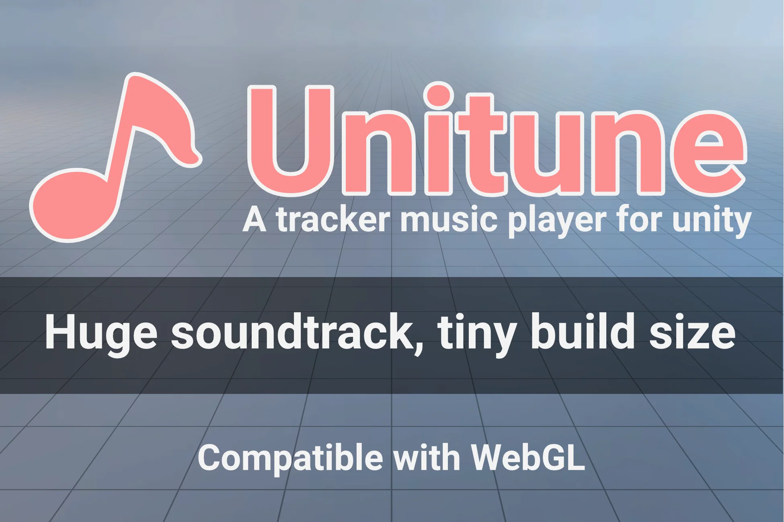

Title: Index
NoSidebar: true
NoRightSidebar: true
xref: bootstrapper
HasUnityWebGL: true
---
```raw
@section Title { }
```



<div class="text-center mb-4">

#### **A WebGL-compatible easy-to-use tracker music player for Unity by [Mathieu Philippe](https://www.moartis.dev).**
#### **Huge soundtrack, tiny build size!**


When working on a retro WebGL game for a client, I realized that the majority of the build size was due to the music files.
While we were using [tracker music](https://en.wikipedia.org/wiki/Module_file), as Unity natively supports the most common formats, they are [converted to AAC when targeting WebGL](https://discussions.unity.com/t/audio-file-formats-and-webgl-it/590592).
This translated to a 1000% increase in our expected build size. 😱


It motivated me to develop a solution: **Unitune**, a tracker player that converts module files to AudioClips at runtime.
Thanks to its generative nature, it will give you more control over your music at runtime while keeping your build size as tiny as possible.
#### **Available right now on the [Unity Asset Store](https://u3d.as/3aq5)**!

</div>

# Key features

<?! KeyFeatures /?>

# Showcase

```raw
<div id="unity-container" class="unity-desktop embed-responsive embed-responsive-16by9">
  <canvas id="unity-canvas" class="embed-responsive-item" tabindex="-1"></canvas>
  <div id="unity-loading-bar">
    <div id="unity-logo"></div>
    <div id="unity-progress-bar-empty">
      <div id="unity-progress-bar-full"></div>
    </div>
  </div>
  <div id="unity-warning"> </div>
</div>

<div id="unity-footer">
  <div id="unity-fullscreen-button"></div>
  <div id="unity-build-title">Fullscreen</div>
</div>

<script>
  var container = document.querySelector("#unity-container");
  var canvas = document.querySelector("#unity-canvas");
  var loadingBar = document.querySelector("#unity-loading-bar");
  var progressBarFull = document.querySelector("#unity-progress-bar-full");
  var fullscreenButton = document.querySelector("#unity-fullscreen-button");
  var warningBanner = document.querySelector("#unity-warning");

  function unityShowBanner(msg, type) {
    function updateBannerVisibility() {
      warningBanner.style.display = warningBanner.children.length ? 'block' : 'none';
    }
    var div = document.createElement('div');
    div.innerHTML = msg;
    warningBanner.appendChild(div);
    if (type == 'error') div.style = 'background: red; padding: 10px;';
    else {
      if (type == 'warning') div.style = 'background: yellow; padding: 10px;';
      setTimeout(function() {
        warningBanner.removeChild(div);
        updateBannerVisibility();
      }, 5000);
    }
    updateBannerVisibility();
  }

  var buildName = "WebGL";
  var buildUrl = "builds/showcase";
  var loaderUrl = buildUrl + "/" + buildName + ".loader.js";
  var config = {
    dataUrl: buildUrl + "/" + buildName + ".data.br",
    frameworkUrl: buildUrl + "/" + buildName + ".framework.js.br",
    codeUrl: buildUrl + "/" + buildName + ".wasm.br",
    streamingAssetsUrl: "StreamingAssets",
    companyName: "SparklingVinegar",
    productName: "Unitune",
    productVersion: "1.0.0",
    showBanner: unityShowBanner,
  };

  loadingBar.style.display = "block";

  var script = document.createElement("script");
  script.src = loaderUrl;
  script.onload = () => {
    createUnityInstance(canvas, config, (progress) => {
      progressBarFull.style.width = 100 * progress + "%";
          }).then((unityInstance) => {
            loadingBar.style.display = "none";
            fullscreenButton.onclick = () => {
              unityInstance.SetFullscreen(1);
            };
          }).catch((message) => {
            alert(message);
          });
        };

  document.body.appendChild(script);

</script>
```
